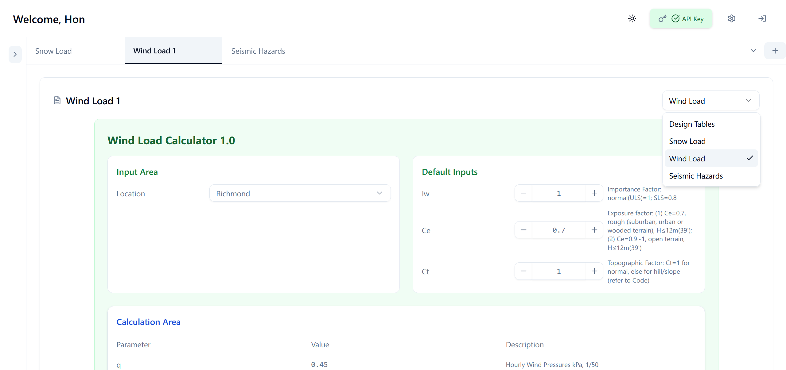

# Construction Van Web

> A modern full-stack engineering analysis platform with real-time, professional workspace management

## Overview

Construction Web is a comprehensive web application designed for construction engineering analysis in Metro Vancouver, featuring hierarchical project organization, real-time synchronization, and specialized calculation tools for structural engineering workflows.

## Key Features

- **Engineering Calculators**: Wind load, snow load, and seismic hazard analysis tools
- **Delta Storage System**: Instant tab creation with template-based architecture and minimal database footprint
- **Advanced Tab Management**: Copy, paste, drag, lock, and bulk operations across projects and pages
- **Debounced Auto-Save**: 1-second auto-save with optimistic updates and background sync
- **Professional UI/UX**: Dark/light themes, responsive design, and accessibility features

## Application Screenshots

### Light Mode Interface

**Snow Load Calculator - Structural Engineering Tool**

Advanced snow load analysis with location-based calculations, and detailed parameter management for structural design.

**Wind Load Calculator - Engineering Analysis Dashboard**

Professional wind load calculation interface with real-time parameter adjustment and calculation results display.

**Seismic Hazards Analysis - Geotechnical Assessment**

Comprehensive seismic data form with secure API key management and professional project documentation.

### Dark Mode Interface

**Soil Classification Results - Data Visualization**

Advanced soil classification system with probability-based analysis, color-coded results, and comprehensive geotechnical data presentation.

**Application Settings - Security Management**

Centralized security dashboard featuring encrypted API key management, data encryption status, and comprehensive user preference controls.


## Engineering Calculations

- **Seismic Analysis**: Location-based hazard assessment with professional reporting
- **Wind Load Calculations**: Real-time parameter adjustment with comprehensive results
- **Snow Load Analysis**: Slope adjustments and detailed structural design parameters

## Tech Stack

### Frontend
- **React 18** with TypeScript for type-safe development
- **Tailwind CSS V3** + **shadcn/ui** for modern, accessible components
- **Custom Hooks** for state management and performance optimization
- **React DnD** for drag-and-drop functionality

### Backend
- **Spring Boot** (Java) - Main application server with JWT authentication
- **Flask** (Python) - Microservice for seismic calculations
- **PostgreSQL** - Primary database with encryption at rest
- **RESTful APIs** with comprehensive validation and security

### DevOps & Infrastructure
- **Docker** containerization with docker-compose orchestration
- **JWT Authentication** with role-based access control
- **Microservices Architecture** with service discovery
- **Environment-based Configuration** for development and production


## Technical Achievements

- **Delta Storage System Innovation**: Template-based system storing complete forms in React with only user changes persisted to database,
 reducing database load by 90% while enabling instant tab creation
- **Complex State Orchestration**: Built custom React hooks managing hierarchical workspace data with optimistic updates
- **Advanced Tab Management**: Implemented full suite of tab management including cut/copy/paste, drag & drop, locking, bulk operations, and cross-page movement
- **Microservice Integration**: Seamlessly connected Java and Python services. Spring Boot for user management, Flask for calculations with real-time data synchronization
- **Auto-Save Architecture**: Developed 1-second debounced auto-save system with immediate UI feedback and background sync
- **Production Security**: Implemented end-to-end AES-GCM 256-bit encryption for sensitive engineering data


## Quick Start

```bash
# Clone and setup
git clone [repository-url]
cp env.template .env
# Configure PostgreSQL credentials in .env

# Start application
docker-compose up -d

# Access at http://localhost:3000
```

## Detailed Setup & Troubleshooting

For complete setup instructions, see [SETUP.md](SETUP.md)


