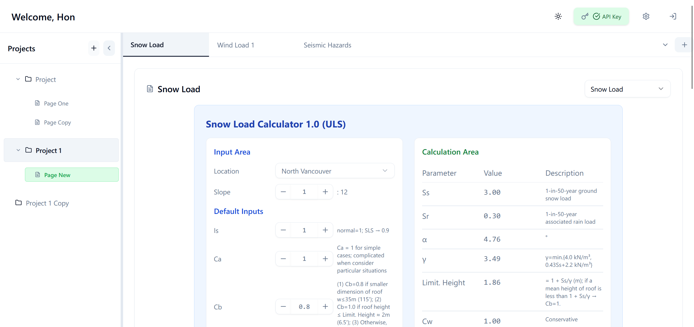
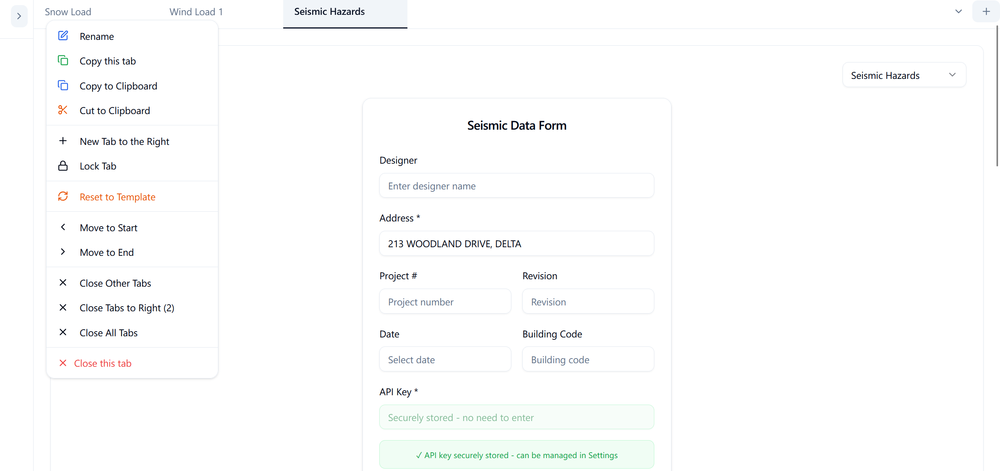

# Construction Van Web

> A modern full-stack engineering analysis platform with real-time, professional workspace management

## Overview

Construction Web is a **full-stack integration platform** designed for construction engineering analysis in Metro Vancouver, featuring **Java Spring Boot** and **Python Flask** microservices intergration, **PostgreSQL database management**, **RESTful API development**, and **production monitoring** for complex engineering workflows.

## Key Features

- **Delta Storage System**: Instant tab creation with template-based architecture and minimal database footprint
- **Database Management**: **PostgreSQL** with **complex SQL queries**, **JPA/Hibernate ORM**, and **performance optimization**
- **API Integration**: **RESTful APIs** with **GraphQL** external service integration and **real-time data synchronization**
- **Debounced Auto-Save**: 1-second auto-save with optimistic updates and background sync
- **Production Monitoring**: **Spring Boot Actuator**, **Docker health checks**, and **comprehensive logging**
- **Advanced Tab Management**: Copy, paste, drag, lock, and bulk operations across projects and pages
- **Professional UI/UX**: Dark/light themes, responsive design, and accessibility features

## Tech Stack

### Backend Services 
- **Java Spring Boot** - Main application server with **JWT authentication** and **microservice coordination**
- **Python Flask** - Specialized calculation microservice with **RESTful endpoints**
- **PostgreSQL** - Production database with **complex queries**, **JPA/Hibernate**, and **performance optimization**
- **Spring Security** - **Role-based access control** with **BCrypt password encryption**
- **Maven** - Build automation and dependency management

### Database & SQL Operations
- **PostgreSQL 15** with **advanced indexing** and **query optimization**
- **JPA/Hibernate** - Object-relational mapping and **complex data relationships**
- **Delta-based Updates** - **90% database load reduction** through intelligent change detection
- **Connection Pooling** - **HikariCP** for optimal performance and **health monitoring**

### Integration & APIs
- **RESTful APIs** - Comprehensive **validation**, **error handling**, and **security**
- **GraphQL Integration** - External seismic data API with **real-time queries**
- **External API Integration** - **OpenCage Geocoding** and **Natural Resources Canada** services
- **JWT (JSON Web Tokens)** - Stateless authentication with **24-hour token expiration**

### DevOps & Infrastructure
- **Docker** containerization with **docker-compose orchestration**
- **Health Monitoring** - **Spring Boot Actuator** with **/actuator/health** endpoints
- **Service Discovery** - Automated startup sequence and **dependency management**
- **Environment Configuration** - Development and production deployment management

### Frontend Interface
- **React 18** with **JavaScript** for real-time data visualization
- **Tailwind CSS V3** + **shadcn/ui** for modern, accessible components
- **Custom Hooks** for state management and performance optimization
- **React DnD** for drag-and-drop functionality

## Engineering Applications

- **Seismic Analysis**: **Location-based requests** with **real-time API integration**
- **Wind Load & Snow Load Calculations**: **Parameter processing** with **automated detailed result generation**

## Application Screenshots

### Light Mode Interface

**Snow Load Calculator - Structural Engineering Tool**

Advanced snow load analysis with location-based calculations, and detailed parameter management for structural design.

**Wind Load Calculator - Engineering Analysis Dashboard**

Professional wind load calculation interface with real-time parameter adjustment and calculation results display.

**Seismic Hazards Analysis - Geotechnical Assessment**

Comprehensive seismic data form with secure API key management and professional project documentation.

### Dark Mode Interface

**Soil Classification Results - Data Visualization**

Advanced soil classification system with probability-based analysis, color-coded results, and comprehensive geotechnical data presentation.

**Application Settings - Security Management**

Centralized security dashboard featuring encrypted API key management, data encryption status, and comprehensive user preference controls.


## Quick Start

```bash
# Clone and setup
git clone [repository-url]
cp env.template .env
# Configure PostgreSQL credentials in .env

# Start application
docker-compose up -d

# Access at http://localhost:3000
```

## Detailed Setup & Troubleshooting

For complete setup instructions, see [SETUP.md](SETUP.md)


